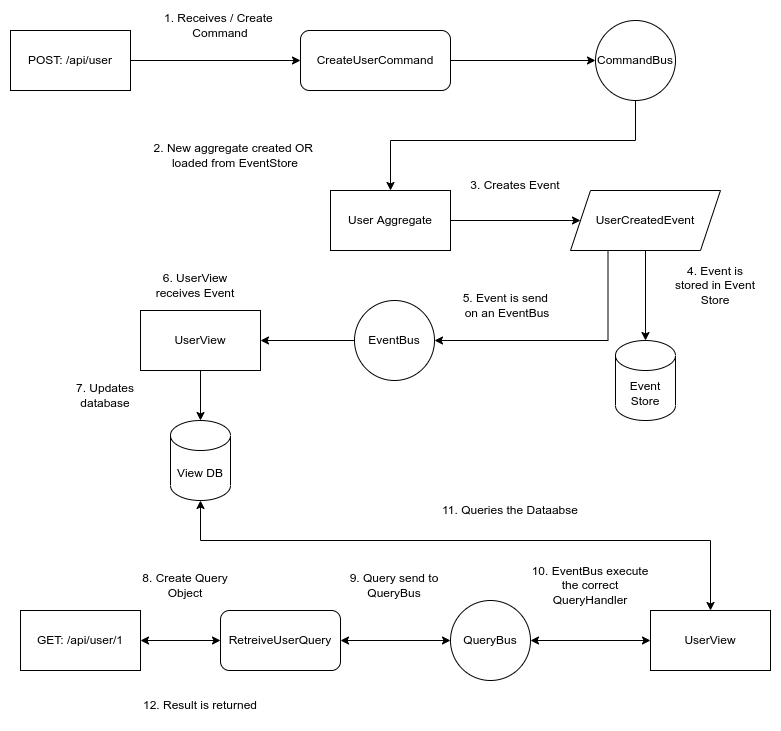

CQRS is a pattern where the write and read sides are split in an application, maximizing performance and scalability. CQRS is an abbreviation for Command, Query Responsibility Segregation. A CQRS application is composed of commands, queries, and events.  Let's look at the building blocks of a CQRS application.

## The Write Side

**Aggregate**

An Aggregate is a collection of one or more entities that can be seen as a single unit. For example an Order with line items, a Shopping Cart with each product and quantity.

**Commands**

Commands are instructions for modifying the state of an Aggregate. It is an action that can be performed.

**Event**

An event is a data structure that captures the state change in an Aggregate. Events are published in the system. One or more consumers listen to the event and perform an action. The most common action is to update a view database. Events are immutable and are stored in an Event store.

**Event Store**

Each immutable event is stored in an event source database. The event itself is only ever inserted and will not change for the lifetime of the application.

**Event Sourcing.**

An Aggregates state is composed of one or more events. An aggregate is hydrated by loading all events associated with the aggregate and applying it to itself (the aggregate instance). The event store with its events becomes the source of truth.

**View database**

The view database is your data warehouse, where you store all information in an accessible way for usage by a REST API or other querying mechanism. The data in the views database is built up in time using events. As each event contains the changes for the aggregate, we can use this information to keep the data in the view database in sync with the Event store.

## The Read Side

**Query**

A query is a data structure that contains parameters for querying data. Typically this would be page number, row count, any search parameters, etc.

**Query Handler**

The query handler receives the query object and queries the database. It uses the information contained in the query object to retrieve specific information. Its job is to take the query input parameters, query the database, and return the information from the database to the caller, in this case, the REST API.

## Understanding how each component fits together to form the big picture.

Here is a simplified diagram of how each component fits together.

1. A command is received from REST API, but note that the command can originate from anywhere.
2. The command is sent to the CommandBus which sends it to an Aggregate handler. If the Aggregate does not exist, a new instance is constructed.
3. The Aggregate handler handles the specific command in this case the CreateUserCommand. It emits a UserCreatedEvent.
4. The UserCreatedEvent is appended/stored in the event store.
5. When the event has been stored successfully, it is sent to the EventBus which sends the event to one or more event handlers.
6. In this case, we have a UserView service that receives the UserCreatedEvent.
7. The new user is inserted into the user's table.
8. A query object is constructed in this case a RetreiveUserQuery.
9. It is sent to the QueryBus.
10. The QueryBus executes the correct QueryHandler in this case the UserView service.
11. The UserView service queries the database, retrieves the data, and returns it to the caller.
12. The resulting data is returned to the API caller.

This is a quick overview of how CQRS work. Till next time.
